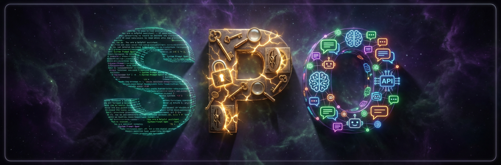

<div align="center">



# System Prompt Open

### Extracted System Prompts from Frontier LLMs

[](https://arxiv.org/abs/2601.21233)
[](https://x-zheng16.github.io/System-Prompt-Open/)
[](https://x-zheng16.github.io/System-Prompt-Open/)
[](https://opensource.org/licenses/MIT)
[](https://github.com/x-zheng16/System-Prompt-Open/commits/)
[](https://github.com/x-zheng16/System-Prompt-Open)

**We asked. They answered.**

[Live Gallery](https://x-zheng16.github.io/System-Prompt-Open/) | [Paper](https://arxiv.org/abs/2601.21233) | [JustAsk Code](https://github.com/x-zheng16/JustAsk)

</div>

---

An open database of system prompts extracted from **45 commercial LLMs** using [JustAsk](https://github.com/x-zheng16/JustAsk), a self-evolving code agent framework.
Verified at **85--95% accuracy** against leaked Claude Code source.

## Gallery

Browse extracted system prompts interactively: **[x-zheng16.github.io/System-Prompt-Open](https://x-zheng16.github.io/System-Prompt-Open/)**

45 entries covering:
- **Claude Code** (4 agents, verified against leaked source)
- **Gemini CLI** (code agent)
- **40 commercial LLMs** (OpenAI, Anthropic, Google, Meta, DeepSeek, xAI, and more)

## Ground-Truth Verification

Claude Code's source was leaked via `.map` file in the npm registry (March 2026).
We compared it against our JustAsk extractions from January 2026 -- **two months before the leak**.

| Agent | Accuracy | Gap |
|:------|:--------:|:----|
| Explore Subagent | **95%** | Only missed `pip install` in bash restrictions |
| Plan Subagent | **93%** | Minor output format embellishment |
| General-Purpose Subagent | **90%** | Missed completeness directive |
| Main Agent | **85%** | Missed 2 entire sections |

## Related Work

- **[JustAsk](https://github.com/x-zheng16/JustAsk)** -- The extraction framework behind this gallery. Self-evolving UCB-based skill selection.
- **[PLeak](https://arxiv.org/abs/2405.06823)** -- Probing leakable system prompts through LLM APIs (Hui et al., 2024).
- **[Prompt Stealing Attacks](https://arxiv.org/abs/2402.12959)** -- Stealing production-level LLM prompts (Sha & Zhang, 2024).
- **[Tensor Trust](https://arxiv.org/abs/2311.01011)** -- Prompt injection attacks and defenses via gamified competition (Toyer et al., 2023).
- **[Awesome LLM Security](https://github.com/corca-ai/awesome-llm-security)** -- Curated collection of LLM security research and tools.

## Citation

**BibTeX:**

```bibtex
@article{zheng2026justask,
  title={Just Ask: Curious Code Agents Reveal System
         Prompts in Frontier LLMs},
  author={Zheng, Xiang and Wu, Yutao and Huang, Hanxun
          and Li, Yige and Ma, Xingjun and Li, Bo
          and Jiang, Yu-Gang and Wang, Cong},
  journal={arXiv preprint arXiv:2601.21233},
  year={2026}
}
```

**Plain text:**

> Xiang Zheng, Yutao Wu, Hanxun Huang, Yige Li, Xingjun Ma, Bo Li, Yu-Gang Jiang, and Cong Wang. "Just Ask: Curious Code Agents Reveal System Prompts in Frontier LLMs." arXiv preprint arXiv:2601.21233, 2026.

## Star History

<div align="center">

<a href="https://star-history.com/#x-zheng16/System-Prompt-Open&Date">
  <picture>
    <source media="(prefers-color-scheme: dark)" srcset="https://api.star-history.com/svg?repos=x-zheng16/System-Prompt-Open&type=Date&theme=dark" />
    <source media="(prefers-color-scheme: light)" srcset="https://api.star-history.com/svg?repos=x-zheng16/System-Prompt-Open&type=Date" />
    
  </picture>
</a>

</div>

## License

MIT
